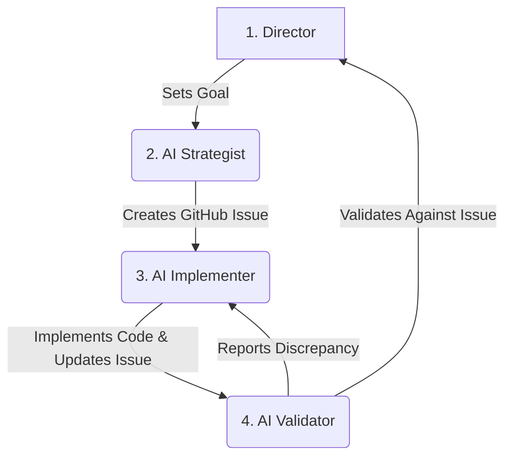

# AGENTS.md: AI Collaboration Protocol

This document provides all necessary instructions for AI agents (like Gemini, Claude, ChatGPT) to effectively contribute to the `category-blueprint` project.

**Core Philosophy**: This project operates on a **Database-Driven Workflow**. GitHub Issues are the single, non-negotiable source of truth for all tasks, features, bugs, and status. Files in this repository are for reference, specification, or logging—never for status tracking.

---

## 🚀 New Session Quick Start

All AI sessions must begin by following these steps to ensure proper orientation and environment configuration.

### Step 1: Validate Your Environment
*Run this script first to check all dependencies and authentications.*
```bash
./scripts/validate-workflow.sh
```

### Step 2: Understand the Core Workflow
*Read these two files to understand the project's protocols.*
```bash
# 1. The "Why": The philosophy and rules of our database-driven system.
cat /Users/petergiordano/Documents/GitHub/category-blueprint/docs/DATABASE_DRIVEN_WORKFLOW.md

# 2. The "How": The practical steps for setting up and using the automation scripts.
cat /Users/petergiordano/Documents/GitHub/category-blueprint/docs/GITHUB_CLI_ISSUE_TRACKING_SETUP.md
```

### Step 3: Identify Current Work
*Use these commands to see active tasks. Do NOT rely on markdown files for project status.*
```bash
# Get a board-level view of all issues and their status in the CLI
gh project item-list 1 --owner petergiordano

# (Optional) Open the live project board in your browser for a visual view
gh project view 1 --owner petergiordano --web
```

### Step 4: Review Recent Code Changes
*Check the latest commits to understand recent implementation history.*
```bash
git log --oneline -10
```

---

## 🤖 4-Agent Collaboration Model

This project uses a four-agent model to ensure a clear and efficient workflow from strategy to validated implementation.

### Agent Roles & Responsibilities

1.  **The Director (User/Pete)**
    *   **Role**: Project Visionary & Strategist.
    *   **Responsibilities**: Defines high-level goals, approves plans, resolves strategic ambiguity, and provides the final sign-off on features and direction.

2.  **The AI Strategist (Browser-Based LLM)**
    *   **Role**: Strategic Planner & Task Drafter.
    *   **Responsibilities**: Works with the Director to brainstorm features, translate strategic goals into technical requirements, and draft the initial specifications.
    *   **Primary Output**: Creates a well-defined GitHub Issue using the `./scripts/create-issue-ai.sh` or other issue creation scripts.

3.  **The AI Implementer (Claude Code in VS Code)**
    *   **Role**: Code Implementation Engine.
    *   **Responsibilities**: Takes a specific GitHub Issue, writes the code to meet all acceptance criteria, performs initial self-testing, and updates the issue status (e.g., to `status-in-progress`).
    *   *(See CLAUDE.md for detailed protocol.)*

4.  **The AI Validator (Gemini CLI)**
    *   **Role**: Quality Assurance & Protocol Enforcement.
    *   **Responsibilities**: Takes a completed issue, runs `./scripts/validate-workflow.sh`, verifies the implementation against the issue's acceptance criteria, checks for adherence to project standards, and reports a `VALIDATION_PASSED` or `DISCREPANCY_REPORT` using the official handoff protocol.
    *   *(See .gemini/GEMINI.md for detailed protocol.)*

### Visual Workflow

This diagram illustrates the flow of work from idea to completion:



---
