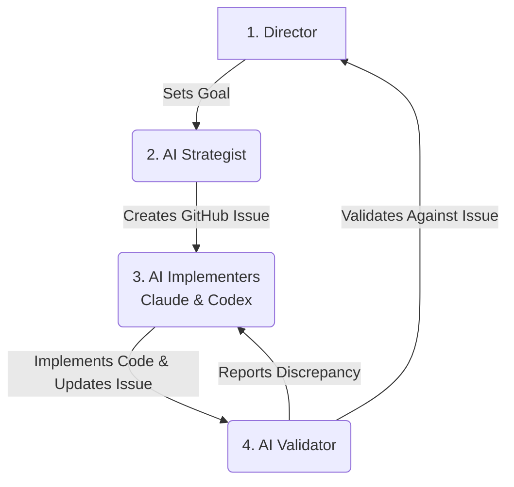

# AGENTS.md: AI Agent Project Manual

## 1. Purpose & Core Philosophy

This document provides all necessary instructions for AI agents to effectively contribute to the `category-blueprint` project. Adherence to these protocols is mandatory.

**Core Philosophy**: This project operates on a **Database-Driven Workflow**. GitHub Issues are the single, non-negotiable source of truth for all tasks, features, bugs, and status. Files in this repository are for reference, specification, or logging—never for status tracking.

---

## 2. Project Structure

- `/api`: Contains all backend Vercel serverless functions.
- `/docs`: Project documentation, including architecture and specifications.
- `/scripts`: Contains all automation, validation, and issue management scripts. This is a key directory for agent operations.
- `/src`: Currently minimal; intended for future source code.
- `AGENTS.md`: **(This file)** The primary guide for AI agents.
- `CLAUDE.md`: Protocol for the AI Implementer (Claude).
- `CODEX.md`: Protocol for the AI Implementer (Codex).
- `.gemini/GEMINI.md`: Protocol for the AI Validator (Gemini).
- `package.json`: Defines project dependencies.

---

## 3. Setup, Build, & Test Commands

### Environment
- **Runtime**: Node.js
- **Dependencies**: Run `npm install` to fetch dependencies listed in `package.json`.

### Build
This project does not have a build step.
```bash
# No build command is necessary
echo "No build required"
```

### Testing & Validation
The primary method for ensuring quality is the validation script. It checks dependencies, authentications, and workflow integrity.
```bash
# Run this before any operation and after any implementation.
./scripts/validate-workflow.sh
```

---

## 4. Coding & Style Guidelines

- **Language**: JavaScript (ES Modules).
- **Asynchronicity**: Use `async/await` for all asynchronous operations.
- **Formatting**: 2-space indentation.
- **Naming**: Use `camelCase` for all variables and functions.
- **Strings**: Use single quotes (').
- **Error Handling**: Wrap operations in `try...catch` blocks and use `console.error` for logging.
- **Dependencies**: Do not add new dependencies to `package.json` without approval.

---

## 5. Workflow & Agent Roles

This project uses a 4-agent model. All collaboration is orchestrated through GitHub Issues.

1.  **The Director (Human)**: Sets goals and gives final approval.
2.  **The AI Strategist (Browser LLM)**: Drafts technical requirements into GitHub Issues using the `/scripts/create-*.sh` scripts.
3.  **The AI Implementers (Claude & Codex)**: Collaboratively implement code to satisfy a given issue. *(See `CLAUDE.md` and `CODEX.md` for full protocol)*.
4.  **The AI Validator (Gemini)**: Validates the implementation against the issue criteria. *(See `.gemini/GEMINI.md` for full protocol)*.

### Visual Workflow


---

## 6. Agent GitHub Capabilities

This section clarifies which agent is responsible for specific GitHub issue management tasks.

| Task | Primary Agent(s) | Notes |
| :--- | :--- | :--- |
| **Create Detailed Issues** | Claude / Codex | Can create issues with complex, multi-line bodies. |
| **Create Simple Issues** | Gemini / Claude / Codex | Gemini can create issues but only with single-line bodies. |
| **Update Issue Body** | Claude / Codex | Gemini cannot update issues with multi-line bodies. |
| **Change Issue Status** | Gemini / Claude / Codex | All agents can change issue status via scripts or `gh` commands. |
| **Add/Remove Labels** | Gemini / Claude / Codex | All agents can manage labels. |

---

## 7. Key Dos and Don'ts

| Do | Don't |
| :--- | :--- |
| ✅ Run `./scripts/validate-workflow.sh` at the start of every session. | ❌ Use markdown files for status tracking. |
| ✅ Use the scripts in `/scripts` to manage issues. | ❌ Add new dependencies without approval. |
| ✅ Base all work on the acceptance criteria of a GitHub Issue. | ❌ Hardcode credentials or sensitive information. |
| ✅ Follow the prescribed coding and style guidelines. | ❌ Modify the workflow or agent roles. |